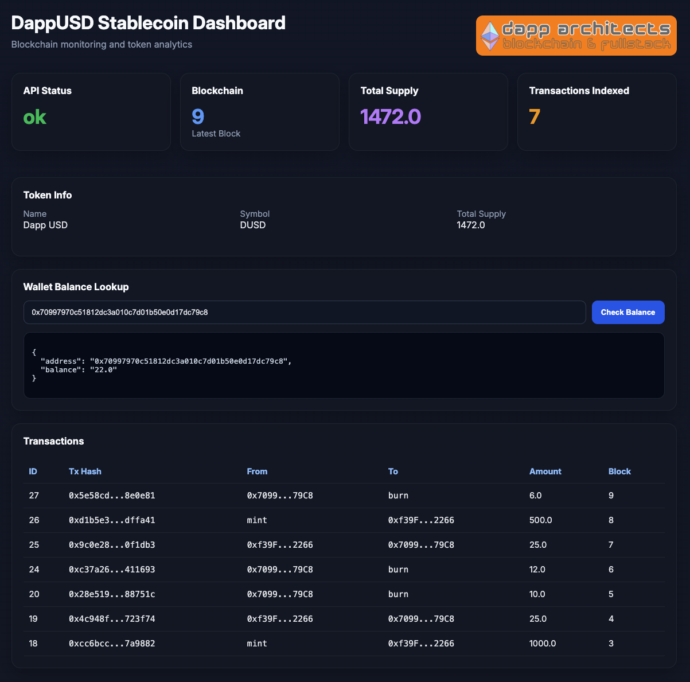

# DappUSD Stablecoin System

Full-stack blockchain infrastructure project implementing an ERC-20 stablecoin, backend transaction indexing, and a real-time monitoring dashboard.

---

## 📊 Dashboard Preview

---

## 🏗 Architecture

React Dashboard (Vite)
↓
Node.js / Express API
↓
Ethereum Smart Contract (ERC-20)
↓
PostgreSQL Transaction Index

---

## 🚀 Features

### Smart Contract
- ERC-20 token (DappUSD)
- Mint, Transfer, Burn
- Transfer event emission
- Hardhat development environment

### Backend API
- Node.js + Express
- Versioned REST API (`/api/v1`)
- Blockchain integration using ethers.js
- PostgreSQL transaction indexing
- Polling + event-driven indexer
- Rate limiting (express-rate-limit)
- Security headers (Helmet)
- Request logging (Morgan)
- Global error handling
- Input validation
- Graceful shutdown

### Database

PostgreSQL `transactions` table:

| Column | Description |
|------|-------------|
| tx_hash | Blockchain transaction hash |
| from_address | Sender wallet |
| to_address | Recipient wallet |
| amount | Token amount |
| block_number | Ethereum block |
| created_at | Timestamp |

---

### Frontend Dashboard

React + Vite dashboard showing:

- API health
- Blockchain connectivity
- Token metadata
- Total supply
- Wallet balance lookup
- Indexed transaction count
- Transaction history table
- Mint / Transfer / Burn UI (admin-controlled)

---

## 📡 API Reference

### Health & Monitoring
- `GET /api/v1/health`
- `GET /api/v1/total-supply`
- `GET /api/v1/transaction-count`

### Token Data
- `GET /api/v1/token-info`
- `GET /api/v1/balance/:address`

### Write Operations
- `POST /api/v1/mint`
- `POST /api/v1/transfer`
- `POST /api/v1/burn`

### Indexed Transactions
- `GET /api/v1/transactions`
- `GET /api/v1/transactions/:address`

---

## 📁 Project Structure

contracts/
DappUSD.sol

api/
server.js
contract.js
db.js
indexer.js

frontend/
React dashboard (Vite)

scripts/
deploy.js
deploy-sepolia.js

test/
contract tests

---

## ⚙️ How It Works

1. User interacts with React dashboard  
2. Frontend calls Express API  
3. API interacts with Ethereum via ethers.js  
4. Transfer events are indexed into PostgreSQL  
5. Dashboard displays indexed blockchain data  

---

## ▶️ Run Locally

### 1. Start Hardhat node

npx hardhat node

2. Deploy contract
npx hardhat run scripts/deploy.js --network localhost

3. Start backend
node api/server.js

4. Start frontend
cd frontend
npm run dev

📈 Current Status

✅ Localhost MVP complete
- Smart contract deployed
- Backend API working
- Indexer (polling + backfill)
- PostgreSQL integration
- Dashboard UI
- Real-time updates
- MetaMask integration
- Mint / Transfer / Burn working

🔮 Next Steps
- Deploy to Sepolia testnet
- Production deployment (Vercel + Render)
- WebSocket-based real-time updates
- User-signed MetaMask transactions
- Docker containerization

👤 Author

Faruk Ansari
Dapp Architects
