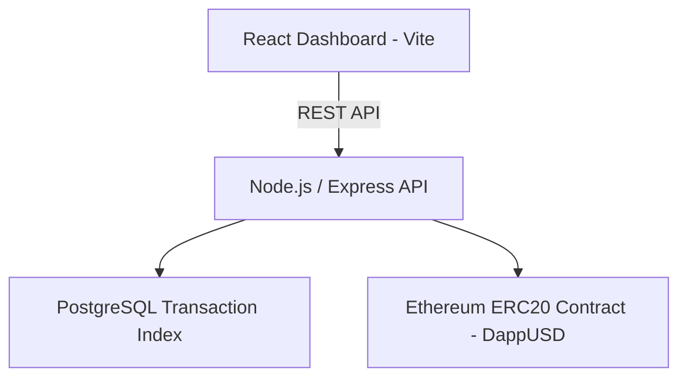

# DappUSD Stablecoin System

Full-stack blockchain infrastructure project implementing an ERC-20 stablecoin, backend transaction indexing, and a monitoring dashboard.

## Architecture

React Dashboard  
↓  
Node.js / Express API  
↓  
Ethereum Smart Contract (ERC-20)  
↓  
PostgreSQL Transaction Index

## Features

### Smart Contract
- ERC-20 token (DappUSD)
- Mint, Transfer, Burn
- Transfer event emission
- Hardhat development environment

### Backend API
- Node.js + Express
- Versioned REST API (`/api/v1`)
- Blockchain integration using ethers.js
- PostgreSQL transaction indexing
- Event-driven blockchain indexer
- Rate limiting
- Security headers (Helmet)
- Request logging (Morgan)
- Global error handling
- Input validation
- Graceful shutdown

### Database
PostgreSQL table:

| Column | Description |
|------|-------------|
| tx_hash | Blockchain transaction hash |
| from_address | Sender wallet |
| to_address | Recipient wallet |
| amount | Token amount |
| block_number | Ethereum block |
| created_at | Timestamp |

### Frontend Dashboard
React + Vite dashboard showing:

- API health
- Blockchain connectivity
- Token metadata
- Total supply
- Wallet balance lookup
- Indexed transaction count
- Transaction history table

## API Endpoints

### System

contracts/
DappUSD.sol

api/
server.js
contract.js
db.js
indexer.js

frontend/
React dashboard

scripts/
deploy.js

test/
contract tests

## How It Works

1. Users interact with the React dashboard.
2. The frontend calls the Express API.
3. The API interacts with the Ethereum smart contract using ethers.js.
4. Transfer events are automatically indexed into PostgreSQL.
5. The dashboard displays indexed blockchain data.

## Next Steps

Planned improvements:

- Deploy smart contract to Sepolia testnet
- MetaMask wallet login
- UI transaction sending
- Docker containerization
- Cloud deployment
- Vercel frontend deployment

## Author

Faruk Ansari  
Dapp Architects

## System Architecture

